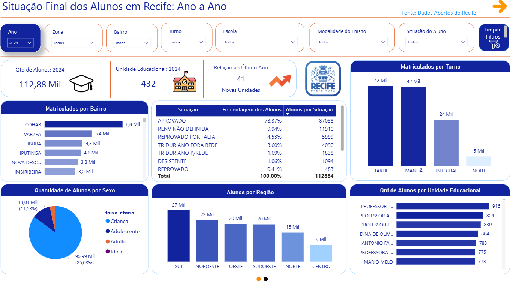
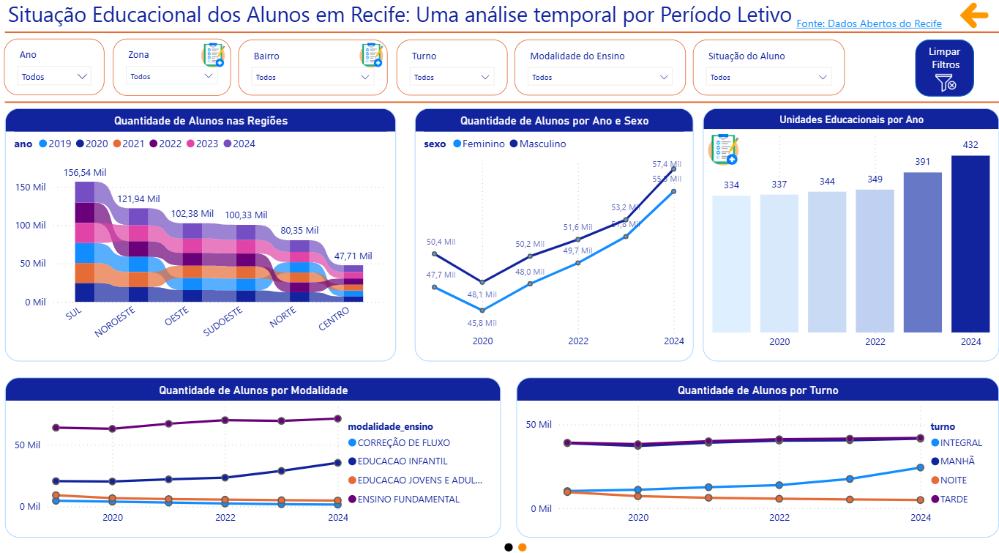

<h1> 📊 PROJETO POWER BI - PREFEITURA DO RECIFE (HUB DE DADOS)</h1>

A Prefeitura do Recife disponibiliza um amplo acervo de informações públicas por meio de sua política de Dados Abertos, garantindo transparência e incentivando a inovação. Com base nesses dados, desenvolvi uma solução intuitiva para a análise da situação final dos alunos por período letivo. Utilizando o Power BI, criei um dashboard acessível e visualmente claro, permitindo que qualquer cidadão compreenda as informações de forma rápida e eficiente.

🔹 Objetivo do Projeto

📌 Facilitar a análise dos dados educacionais da Prefeitura do Recife.

📌 Tornar as informações mais acessíveis para gestores, pesquisadores e cidadãos.

📌 Incentivar o uso de dados abertos na tomada de decisões.

<h2> 🚀 Próximos Passos </h2>

O próximo passo consiste em submeter o projeto ao Hub de Dados, tornando as informações acessíveis a todos os cidadãos brasileiros, com ênfase especial na realidade e nas necessidades dos recifenses.

<h2> 📂 Fonte dos Dados </h2>

🔗 DataSet utilizado: <a href="http://dados.recife.pe.gov.br/dataset/situacao-final-dos-alunos-por-periodo-letivo" target="_blank">Situação Final dos Alunos por Período Letivo</a>

🔗 Hub de Dados: <a href="https://hubdedados.recife.pe.gov.br/" target="_blank">Hub de Dados Recife</a>

<h2> 📌 Visualizações do Dashboard </h2>
<h5> 📍 Página 1: Análise Ano a Ano dos Períodos Letivos</h5>

<h5> 📍 Página 1: Análise temporal por Período Letivo</h5>

<h2>👨‍💻 Criador</h2>
<table> <tr> <td align="center"> <a href="https://www.linkedin.com/in/higor-cabrall/">    <b>Higor Cabral</b> </a> </td> </tr> </table>

<h5>📌 LinkedIn: <a href="https://www.linkedin.com/in/higor-cabrall/" target="_blank">Higor Cabral</a></h5>

<h4>🎯 Como Contribuir?</h4>
Se você tem sugestões de melhorias ou deseja colaborar com este projeto, fique à vontade para abrir uma issue ou enviar um pull request.

